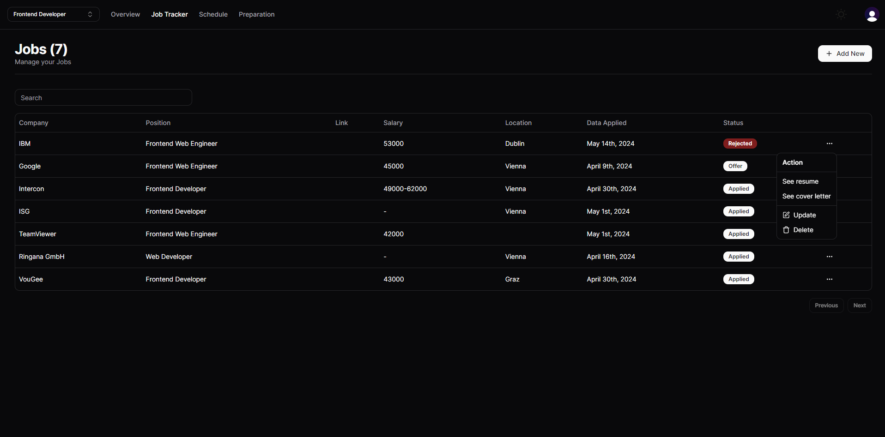
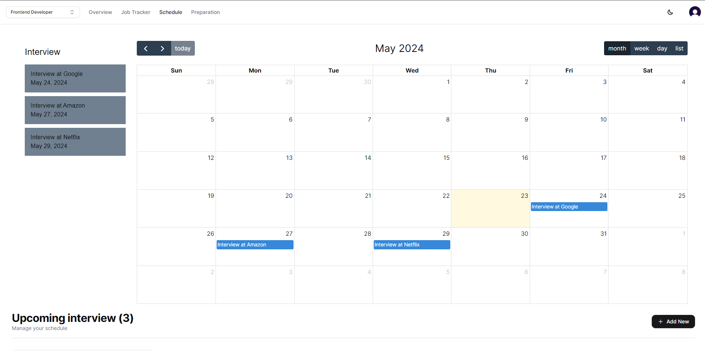

# Job Tracker

Designed and implemented a robust Job Tracker Application that enables users to efficiently manage job applications and schedule interviews. Features an integrated calendar for seamless planning and reminders."


## Tech Stack

**Client:** Nextjs, Prisma, TailwindCSS, Zustand, ShadcnUI, Tremor

**Server:** Nextjs, Clerk, MySQL, Prisma, Edge


## Environment Variables

To run this project, you will need to add the following environment variables to your .env file

`CLERK_SECRET_KEY`

`NEXT_PUBLIC_CLERK_PUBLISHABLE_KEY`

`EDGE_STORE_ACCESS_KEY`

`EDGE_STORE_SECRET_KEY`

`DATABASE_URL`


## Run Locally

Clone the project

```bash
  git clone https://github.com/Vladyslavua3/jobTracker.git
```

Go to the project directory

```bash
  cd my-project
```

Install dependencies

```bash
  npm install
```

Start the server

```bash
  npm run start
```


## Screenshots




